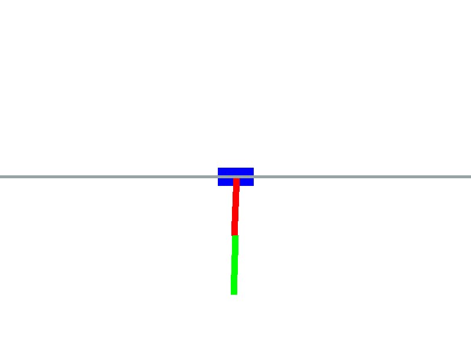
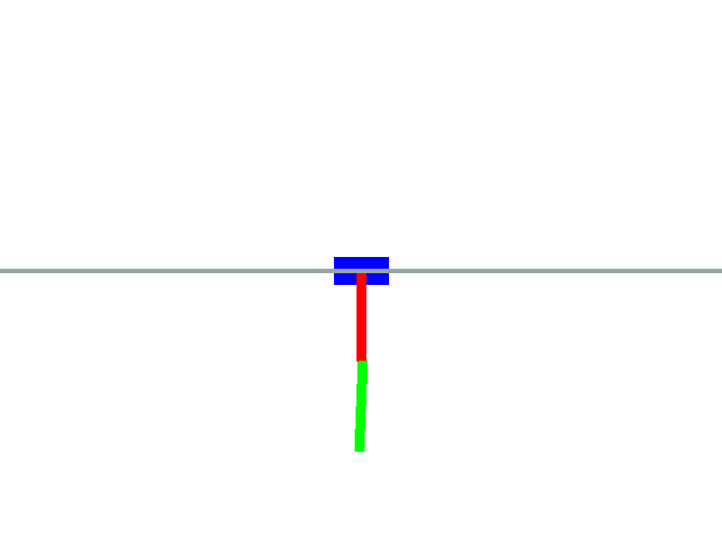
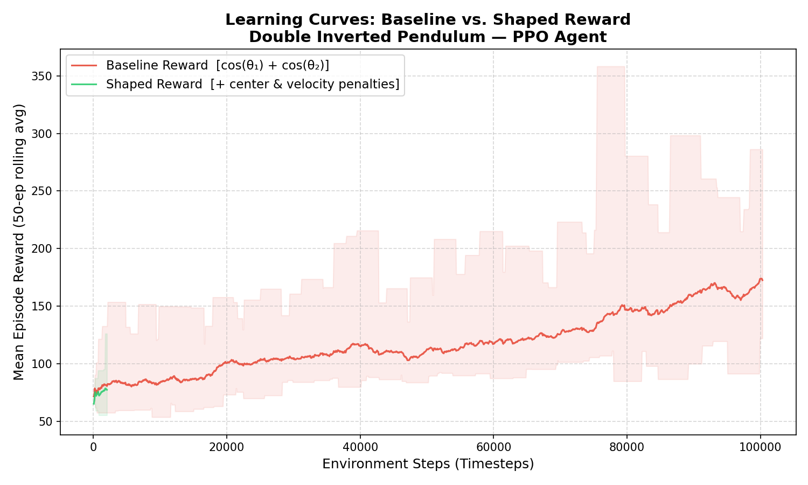

# Double Inverted Pendulum — Reinforcement Learning with PPO

A custom 2D physics-based reinforcement learning environment built with **pymunk** and trained using **Proximal Policy Optimization (PPO)** from `stable-baselines3`. The agent learns to balance two poles stacked on a sliding cart — a classic control challenge.

---

## Demo

| Early Training (`agent_initial.gif`) | Fully Trained (`agent_final.gif`) |
|---|---|
|  |  |

**Learning Curves:**


---

## Project Structure

```
.
├── environment.py         # Custom DoublePendulumEnv (Gym-compatible)
├── train.py               # PPO training script
├── evaluate.py            # Evaluation & GIF generation script
├── plot.py                # Plots baseline vs. shaped reward learning curves
├── Dockerfile             # Container build instructions
├── docker-compose.yml     # Service orchestration
├── requirements.txt       # Python dependencies
├── .env.example           # Environment variable documentation
├── reward_comparison.png  # Learning curve comparison plot
└── media/
    ├── agent_initial.gif  # Agent early in training
    └── agent_final.gif    # Fully trained agent
```

---

## Environment Design

The `DoublePendulumEnv` class in `environment.py` conforms to the **OpenAI Gymnasium** (`gym.Env`) interface.

### Physics Simulation (pymunk)

- **Space**: A `pymunk.Space` with downward gravity simulates the physical world.
- **Cart**: A rigid body constrained to a horizontal axis via a `pymunk.GrooveJoint`.
- **Pole 1**: Attached to the cart's pivot via `pymunk.PivotJoint`.
- **Pole 2**: Attached to the top of Pole 1 via a second `pymunk.PivotJoint`.
- All joints allow free rotation, making the system naturally unstable.

### Observation Space

A 6-dimensional continuous vector `Box(shape=(6,))`:

| Index | Feature | Description |
|-------|---------|-------------|
| 0 | `cart_x` | Cart position relative to center (pixels) |
| 1 | `cart_vx` | Cart horizontal velocity |
| 2 | `theta1` | Pole 1 angle (radians from upright) |
| 3 | `omega1` | Pole 1 angular velocity |
| 4 | `theta2` | Pole 2 angle (radians from upright) |
| 5 | `omega2` | Pole 2 angular velocity |

### Action Space

A 1-dimensional continuous vector `Box(low=-1.0, high=1.0, shape=(1,))`.  
The value is scaled internally to a physical force magnitude applied to the cart.

---

## Reward Function Design

### Baseline Reward (`reward_type='baseline'`)

```
reward = cos(theta1) + cos(theta2)
```

This is the simplest meaningful reward — it yields a maximum of **+2.0** when both poles are perfectly upright (angle = 0), and decreases as the poles fall. It defines the core goal but provides no guidance for stability or cart position.

### Shaped Reward (`reward_type='shaped'`)

```
reward = cos(theta1) + cos(theta2)
       - abs(cart_x) * 0.005     # Center penalty
       - (abs(omega1) + abs(omega2)) * 0.01  # Velocity penalty
       - action^2 * 0.001        # Effort penalty
```

**Rationale for each term:**

| Term | Weight | Purpose |
|------|--------|---------|
| `cos(theta1) + cos(theta2)` | 1.0 | Core upright goal — same as baseline |
| `abs(cart_x)` | 0.005 | Prevents the cart from drifting off-screen |
| `abs(omega1) + abs(omega2)` | 0.01 | Penalizes rapid oscillation; encourages smooth, stable control |
| `action^2` | 0.001 | Discourages excessive force; promotes energy-efficient behavior |

The shaped reward significantly accelerates learning by providing **dense, informative feedback** at every timestep, rather than just rewarding the binary goal.

---

## How to Run

### Prerequisites

- [Docker Desktop](https://www.docker.com/products/docker-desktop/)

### 1. Build the Docker Image

```bash
docker compose build
```

### 2. Train the Agent

Train with the **shaped** reward (recommended):
```bash
docker compose run train
```

Train with the **baseline** reward (for comparison):
```bash
docker compose run train_baseline
```

### 3. Evaluate and Generate GIFs

```bash
docker compose run evaluate
```

This renders the trained agent and saves `media/agent_final.gif`.

### 4. Generate the Reward Comparison Plot

```bash
docker compose run plot
```

This reads from `logs/` and saves `reward_comparison.png`.

---

### Running Locally (without Docker)

```bash
pip install -r requirements.txt

# Train
python train.py --timesteps 200000 --reward_type shaped --save_path models/ppo_shaped.zip
python train.py --timesteps 200000 --reward_type baseline --save_path models/ppo_baseline.zip

# Evaluate
python evaluate.py --model_path models/ppo_shaped.zip --gif_path media/agent_final.gif

# Plot
python plot.py
```

---

## Technical Details

| Component | Choice | Reason |
|-----------|--------|--------|
| Physics engine | `pymunk 6.6` | Fast, stable 2D rigid body simulation |
| RL algorithm | PPO | Stable, works well with continuous action spaces |
| RL framework | `stable-baselines3` | Production-quality RL implementations |
| Policy network | `MlpPolicy` | Suitable for low-dimensional vector observations |
| Training device | CPU | Sufficient for this environment |
